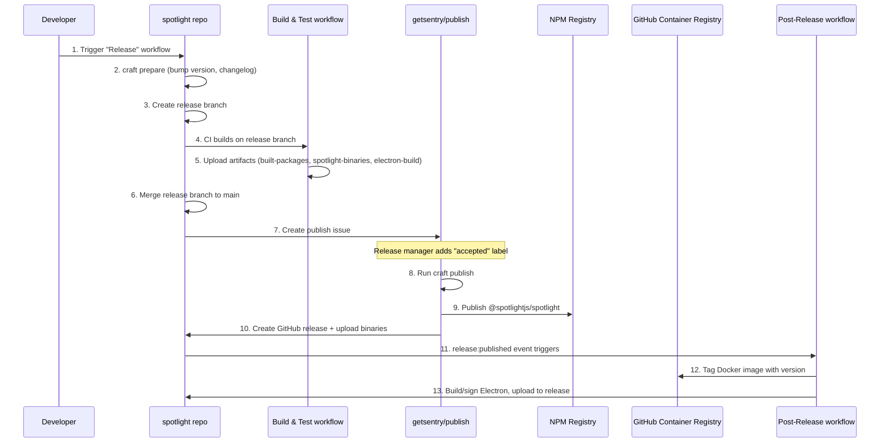

# Spotlight Release Flow with Craft

## Overview

Spotlight uses [Craft](https://github.com/getsentry/craft) for releases, with the [getsentry/publish](https://github.com/getsentry/publish) repository handling NPM/GitHub publishing. The Post-Release workflow in Spotlight handles Docker and Electron after the main release is complete.

## Complete Release Sequence



---

## Workflows

### 1. Release Workflow (`release.yml`)

**Trigger**: Manual (`workflow_dispatch`)

**What it does**:
- Runs `craft prepare` via Craft's reusable workflow
- Bumps version based on conventional commits
- Generates changelog
- Creates release branch
- Creates publish issue in getsentry/publish

### 2. Post-Release Workflow (`publish.yml`)

**Trigger**: `release: published` (after getsentry/publish creates the GitHub release)

**What it does**:
- Tags Docker image with version
- Builds and signs Electron app on macOS
- Uploads Electron binaries to the release

---

## Post-Release Workflow Explained

### Block 1: Metadata and Permissions

```yaml
name: Post-Release

permissions:
  contents: write    # Needed to upload assets to GitHub release
  packages: write    # Needed to tag Docker images in GHCR
```

### Block 2: Triggers

```yaml
on:
  release:
    types: [published]
  workflow_dispatch:
    inputs:
      tag:
        description: "Release tag (e.g., @spotlightjs/spotlight@4.10.0)"
        required: true
```

| Trigger | When | Use Case |
|---------|------|----------|
| `release: published` | Automatically when getsentry/publish creates the GitHub release | Normal release flow |
| `workflow_dispatch` | Manual trigger | Re-run if Docker or Electron failed |

### Block 3: Get Release Info Job

Extracts version from the release tag and finds the build artifacts:

```yaml
TAG="@spotlightjs/spotlight@4.10.0"
VERSION=$(echo "$TAG" | sed 's/.*@/')  # Output: 4.10.0
```

Finds the Build & Test workflow run to download artifacts from.

### Block 4: Docker Job

Tags the Docker image (already built during CI) with the release version:

```yaml
docker buildx imagetools create \
  --tag ghcr.io/getsentry/spotlight:latest \
  --tag ghcr.io/getsentry/spotlight:$VERSION \
  ghcr.io/getsentry/spotlight:$SHA
```

**Note**: No image is rebuilt - `imagetools create` just adds tags to an existing image.

### Block 5: Electron Job

1. **Downloads** pre-built Electron files from CI artifacts
2. **Signs** the app with Apple certificate (`CSC_LINK`)
3. **Notarizes** with Apple (`APPLE_API_KEY`)
4. **Uploads** DMG, ZIP, and update files to the GitHub release

Runs on `macos-latest` because Apple code signing requires macOS.

---

## How getsentry/publish Interacts

### What getsentry/publish Does

1. **Holds all publishing secrets** (NPM_TOKEN, PyPI tokens, etc.)
2. **Requires approval** - release manager must add `accepted` label
3. **Runs `craft publish`** - reads spotlight's `.craft.yml` and publishes

### The Handoff

```
spotlight repo                    getsentry/publish
─────────────────────────────────────────────────────
release.yml runs craft prepare
        │
        └──> Creates publish issue ──────> Issue created
                                                 │
                                    Release manager adds "accepted"
                                                 │
                                    craft publish runs
                                                 │
        GitHub release created <─────────────────┘
        (triggers release:published)
                │
                └──> Post-Release workflow starts
```

### Why This Architecture?

From the [publish repo](https://github.com/getsentry/publish):

> 1. We do not want employees to publish through their own accounts
> 2. We do not want employees to have access to the global credentials
> 3. We want releases to require formal approvals from a limited set of release managers

---

## Secrets Used

| Secret | Where Used | Purpose |
|--------|------------|---------|
| `GITHUB_TOKEN` | All jobs | API access, upload to release |
| `APPLE_API_KEY` | Electron | Apple notarization |
| `CSC_LINK` | Electron | Code signing certificate |
| `CSC_KEY_PASSWORD` | Electron | Certificate password |
| `MAIN_VITE_SENTRY_*` | Electron | Sentry error tracking |

**Note**: `NPM_TOKEN` is NOT needed in spotlight - it's in getsentry/publish.

---

## How to Release

1. Go to **Actions** → **Release** → **Run workflow**
2. Select version: `auto` (from commits), `major`, `minor`, `patch`, or explicit like `4.10.0`
3. Wait for release branch to be created and CI to pass
4. Go to [getsentry/publish issues](https://github.com/getsentry/publish/issues) and find the publish request
5. Add the `accepted` label (requires release manager permissions)
6. Watch the publish complete and Post-Release workflow run

