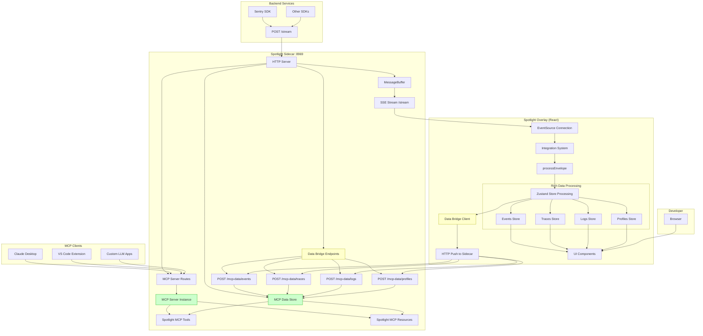
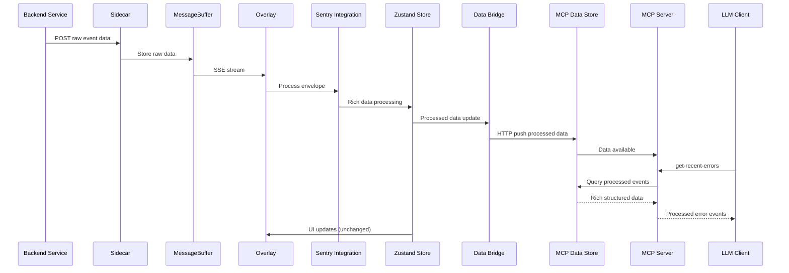

# Alternative MCP Integration Plan: Data Bridge Pattern

## Executive Summary

This document outlines an alternative approach to integrate Model Context Protocol (MCP) server functionality into Spotlight **without moving integration processing from the overlay to the sidecar**. This constraint-based approach uses a data bridge pattern where the overlay pushes processed data to the sidecar for MCP access.

## Constraint Analysis

### Why Integration Processing Cannot Be Moved to Sidecar

Based on detailed analysis of the current architecture, several factors prevent moving integration processing to the sidecar:

#### 1. Browser SDK Integration Dependencies
```typescript
// packages/overlay/src/integrations/sentry/index.ts
const sentryCarrier = (window as WindowWithSentry).__SENTRY__;
const sentryClient = sentryCarrier && getSentryClient(sentryCarrier);
```
- Direct injection into browser's Sentry SDK client via `window.__SENTRY__`
- Browser-specific SDK manipulation and configuration
- Retry logic for SDK detection in browser environment

#### 2. DOM Event System Dependencies
```typescript
// Browser-specific event handling
on("sentry:showError", onRenderError as EventListener);
setTimeout(() => open(`/errors/${e.detail.event.event_id}`), 0);
```
- Uses DOM event listeners for UI interactions
- Direct browser navigation and UI actions
- Custom events for cross-component communication

#### 3. Browser API Dependencies
```typescript
// processStacktrace in sharedSlice.ts
const makeFetch = getNativeFetchImplementation();
const stackTraceWithContextResponse = await makeFetch(get().contextLinesProvider, {
  method: "PUT",
  body: JSON.stringify(exception.stacktrace),
});
```
- Uses browser fetch API for stacktrace context lines
- Browser-specific request handling and CORS
- Native browser implementations for HTTP requests

#### 4. UI State Management Coupling
```typescript
// Tightly coupled with Zustand store for real-time UI updates
const newEventIds = new Map(eventsById);
newEventIds.set(event.event_id, event);
set({ eventsById: newEventIds });

// Notify event subscribers for UI updates
for (const [type, callback] of get().subscribers.values()) {
  if (type === "event") {
    (callback as (event: SentryEvent) => void)(event);
  }
}
```
- Integration processing triggers immediate UI updates
- Real-time subscriber notification system
- Direct Zustand store mutations for component re-rendering

### Value of Processed Overlay Data

The overlay produces rich, processed data structures that are far more valuable for MCP exposure than raw buffer data:

- **Structured Events**: Parsed errors with full stack traces, contexts, and breadcrumbs
- **Trace Trees**: Complex span hierarchies with transaction relationships
- **Correlated Logs**: Logs organized by trace ID with proper severity and SDK info
- **Performance Profiles**: CPU profiles with flame graph data linked to traces
- **SDK Metadata**: Active SDK versions, integrations, and platform details

## Alternative Architecture: Data Bridge Pattern

### Overview



### Data Flow Architecture



## Implementation Design

### Phase 1: Sidecar MCP Data Store (1-2 days)

#### 1.1 Create MCP Data Store
```typescript
// packages/sidecar/src/mcp/dataStore.ts
export interface McpDataStore {
  // Events
  events: Map<string, SentryEvent>;
  pushEvent(event: SentryEvent): void;
  getEvents(options?: EventQuery): SentryEvent[];
  
  // Traces  
  traces: Map<string, Trace>;
  pushTrace(trace: Trace): void;
  getTraceById(id: string): Trace | undefined;
  
  // Logs
  logs: Map<string, SentryLogEventItem>;
  logsByTraceId: Map<string, Set<SentryLogEventItem>>;
  pushLog(log: SentryLogEventItem): void;
  getLogsByTraceId(traceId: string): SentryLogEventItem[];
  
  // Profiles
  profiles: Map<string, SentryProfileWithTraceMeta>;
  pushProfile(traceId: string, profile: SentryProfileWithTraceMeta): void;
  
  // SDK Info
  sdks: Map<string, Sdk>;
  pushSdk(sdk: Sdk): void;
}
```

#### 1.2 Add Data Bridge HTTP Endpoints
```typescript
// packages/sidecar/src/mcp/dataBridgeRoutes.ts
const dataBridgeRoutes = [
  // Processed events from overlay
  [/^\/mcp-data\/events$/, (req, res) => {
    const events = JSON.parse(body) as SentryEvent[];
    events.forEach(event => mcpDataStore.pushEvent(event));
    res.writeHead(200);
    res.end('OK');
  }],
  
  // Processed traces from overlay
  [/^\/mcp-data\/traces$/, (req, res) => {
    const traces = JSON.parse(body) as Trace[];
    traces.forEach(trace => mcpDataStore.pushTrace(trace));
    res.writeHead(200);
    res.end('OK');
  }],
  
  // Add similar endpoints for logs, profiles, sdks
];
```

### Phase 2: Overlay Data Bridge Client (2-3 days)

#### 2.1 Create Data Bridge Client
```typescript
// packages/overlay/src/integrations/sentry/dataBridge.ts
export class SentryDataBridge {
  private sidecarUrl: string;
  private retryQueue: Array<{ endpoint: string; data: any }> = [];
  
  constructor(sidecarUrl: string) {
    this.sidecarUrl = sidecarUrl;
  }
  
  async pushEvents(events: SentryEvent[]): Promise<void> {
    try {
      await fetch(`${this.sidecarUrl}/mcp-data/events`, {
        method: 'POST',
        headers: { 'Content-Type': 'application/json' },
        body: JSON.stringify(events)
      });
    } catch (error) {
      // Add to retry queue
      this.retryQueue.push({ endpoint: 'events', data: events });
      this.scheduleRetry();
    }
  }
  
  async pushTrace(trace: Trace): Promise<void> {
    // Similar implementation for traces
  }
  
  // Retry logic for failed requests
  private scheduleRetry(): void {
    setTimeout(() => this.processRetryQueue(), 1000);
  }
}
```

#### 2.2 Integrate with Store Slices
```typescript
// packages/overlay/src/integrations/sentry/store/slices/eventsSlice.ts
export const createEventsSlice: StateCreator<SentryStore, [], [], EventsSliceState & EventsSliceActions> = (
  set,
  get,
) => ({
  // ... existing code ...
  
  pushEvent: async (event: SentryEvent & { event_id?: string }) => {
    // ... existing processing logic unchanged ...
    
    const newEventIds = new Map(eventsById);
    newEventIds.set(event.event_id, event);
    set({ eventsById: newEventIds });
    
    // NEW: Push processed event to sidecar
    const dataBridge = get().getDataBridge();
    if (dataBridge) {
      await dataBridge.pushEvents([event]);
    }
    
    // ... rest of existing logic unchanged ...
  },
});
```

### Phase 3: MCP Server Implementation (1-2 days)

#### 3.1 MCP Server with Rich Tools
```typescript
// packages/sidecar/src/mcp/server.ts
import { McpDataStore } from './dataStore.js';

export function createSpotlightMcpServer(dataStore: McpDataStore) {
  const server = new Server('spotlight-mcp', '1.0.0');
  
  // Rich error analysis tool
  server.registerTool('get-recent-errors', {
    title: 'Get Recent Errors with Full Context',
    description: 'Get recent error events with stack traces, contexts, and breadcrumbs',
    inputSchema: {
      count: z.number().optional().default(10),
      level: z.enum(['error', 'fatal']).optional(),
      traceId: z.string().optional()
    }
  }, async ({ count, level, traceId }) => {
    const events = dataStore.getEvents({ 
      type: 'error', 
      count, 
      level, 
      traceId 
    });
    
    return {
      content: [{
        type: 'text',
        text: JSON.stringify(events.map(event => ({
          id: event.event_id,
          message: event.exception?.values?.[0]?.value,
          type: event.exception?.values?.[0]?.type,
          stackTrace: event.exception?.values?.[0]?.stacktrace?.frames,
          context: event.contexts,
          breadcrumbs: event.breadcrumbs,
          tags: event.tags,
          user: event.user,
          timestamp: event.timestamp
        })), null, 2)
      }]
    };
  });
  
  // Trace analysis tool with span tree
  server.registerTool('get-trace-with-spans', {
    title: 'Get Complete Trace with Span Tree',
    description: 'Get trace with organized span hierarchy and performance data',
    inputSchema: {
      traceId: z.string()
    }
  }, async ({ traceId }) => {
    const trace = dataStore.getTraceById(traceId);
    if (!trace) {
      throw new Error(`Trace ${traceId} not found`);
    }
    
    return {
      content: [{
        type: 'text',
        text: JSON.stringify({
          trace_id: trace.trace_id,
          status: trace.status,
          root_transaction: trace.rootTransactionName,
          span_tree: trace.spanTree,
          transactions: trace.transactions,
          error_count: trace.errors,
          duration: trace.timestamp - trace.start_timestamp
        }, null, 2)
      }]
    };
  });
  
  // Correlated logs tool
  server.registerTool('get-logs-by-trace', {
    title: 'Get Logs Correlated to Trace',
    description: 'Get all logs associated with a specific trace ID',
    inputSchema: {
      traceId: z.string()
    }
  }, async ({ traceId }) => {
    const logs = dataStore.getLogsByTraceId(traceId);
    
    return {
      content: [{
        type: 'text',
        text: JSON.stringify(logs.map(log => ({
          id: log.id,
          message: log.attributes?.message?.value,
          severity: log.severity_text,
          timestamp: log.timestamp,
          sdk: log.sdk,
          trace_id: log.trace_id,
          span_id: log.span_id
        })), null, 2)
      }]
    };
  });
  
  return server;
}
```

#### 3.2 Rich MCP Resources
```typescript
// Rich resources with processed data
server.registerResource('spotlight-errors', 
  new ResourceTemplate('spotlight://errors/{errorId}', { 
    list: 'spotlight://errors' 
  }), {
    title: 'Error with Full Context',
    description: 'Complete error information including stack trace and related data'
  }, async (uri, { errorId }) => {
    const event = dataStore.getEvents({ eventId: errorId })[0];
    const trace = event.contexts?.trace?.trace_id 
      ? dataStore.getTraceById(event.contexts.trace.trace_id) 
      : null;
    const logs = trace 
      ? dataStore.getLogsByTraceId(trace.trace_id) 
      : [];
    
    return {
      contents: [{
        uri: uri.href,
        text: JSON.stringify({
          error: event,
          related_trace: trace,
          correlated_logs: logs
        }, null, 2),
        mimeType: 'application/json'
      }]
    };
  }
);
```

## Data Bridge Reliability Design

### Fault Tolerance
```typescript
// packages/overlay/src/integrations/sentry/dataBridge.ts
export class SentryDataBridge {
  private retryQueue: Array<{
    endpoint: string;
    data: any;
    attempts: number;
    timestamp: number;
  }> = [];
  
  private maxRetries = 3;
  private retryDelay = 1000;
  
  async pushWithRetry(endpoint: string, data: any): Promise<void> {
    try {
      await this.makeRequest(endpoint, data);
    } catch (error) {
      this.addToRetryQueue(endpoint, data);
    }
  }
  
  private addToRetryQueue(endpoint: string, data: any): void {
    this.retryQueue.push({ 
      endpoint, 
      data, 
      attempts: 0, 
      timestamp: Date.now() 
    });
    this.scheduleRetry();
  }
  
  private async processRetryQueue(): Promise<void> {
    const now = Date.now();
    const itemsToRetry = this.retryQueue.filter(
      item => now - item.timestamp > this.retryDelay * Math.pow(2, item.attempts)
    );
    
    for (const item of itemsToRetry) {
      try {
        await this.makeRequest(item.endpoint, item.data);
        // Remove from queue on success
        this.retryQueue.splice(this.retryQueue.indexOf(item), 1);
      } catch (error) {
        item.attempts++;
        if (item.attempts >= this.maxRetries) {
          // Remove failed items after max retries
          this.retryQueue.splice(this.retryQueue.indexOf(item), 1);
          console.warn(`Failed to sync ${item.endpoint} after ${this.maxRetries} attempts`);
        }
      }
    }
  }
}
```

### Data Synchronization
```typescript
// Batch updates to reduce HTTP overhead
export class SentryDataBridge {
  private pendingEvents: SentryEvent[] = [];
  private pendingTraces: Trace[] = [];
  private batchTimeout: NodeJS.Timeout | null = null;
  
  pushEvent(event: SentryEvent): void {
    this.pendingEvents.push(event);
    this.scheduleBatchSync();
  }
  
  private scheduleBatchSync(): void {
    if (this.batchTimeout) return;
    
    this.batchTimeout = setTimeout(async () => {
      await this.syncBatch();
      this.batchTimeout = null;
    }, 100); // Batch window of 100ms
  }
  
  private async syncBatch(): Promise<void> {
    const events = [...this.pendingEvents];
    const traces = [...this.pendingTraces];
    
    this.pendingEvents = [];
    this.pendingTraces = [];
    
    await Promise.all([
      events.length > 0 ? this.pushWithRetry('events', events) : Promise.resolve(),
      traces.length > 0 ? this.pushWithRetry('traces', traces) : Promise.resolve()
    ]);
  }
}
```

## Benefits of This Architecture

### ✅ **Maintains Current Functionality**
- Overlay integration processing remains unchanged
- All browser-specific dependencies stay in overlay
- UI functionality and performance unaffected
- No risk of breaking existing workflows

### ✅ **Provides Rich MCP Data Access**
- MCP server gets fully processed, structured data
- Error events include full stack traces and context
- Traces include complete span trees and relationships
- Logs are properly correlated by trace ID
- Performance profiles linked to traces

### ✅ **Simple Implementation**
- Uses standard HTTP requests for data bridge
- No complex protocols or WebSocket management
- Fault-tolerant with retry logic
- Batched updates for performance

### ✅ **Scalable Design**
- Data bridge can be extended for new integrations
- MCP server can add new tools and resources easily
- Minimal impact on existing sidecar performance
- Optional feature that can be disabled

## Drawbacks and Mitigations

### ⚠️ **Potential Data Latency**
**Issue**: Small delay between overlay processing and MCP availability
**Mitigation**: 
- Batch updates with short 100ms window
- Immediate sync for high-priority events (errors)
- Async processing doesn't block UI

### ⚠️ **Network Reliability**
**Issue**: HTTP requests between overlay and sidecar could fail
**Mitigation**:
- Comprehensive retry logic with exponential backoff
- Queue management for failed requests
- Graceful degradation if sync fails

### ⚠️ **Memory Usage**
**Issue**: Duplicate data storage in overlay and sidecar
**Mitigation**:
- Implement data cleanup policies (TTL, size limits)
- Only sync essential data needed for MCP
- Optional memory limit configuration

## Configuration Options

```typescript
// packages/sidecar/src/types.ts
interface SidecarOptions {
  // ... existing options ...
  mcp?: {
    enabled: boolean;
    dataBridge?: {
      enabled: boolean;
      batchWindow?: number; // ms
      retryAttempts?: number;
      memoryLimits?: {
        maxEvents?: number;
        maxTraces?: number;
        ttlHours?: number;
      };
    };
    tools?: {
      [toolName: string]: {
        enabled: boolean;
        permissions?: string[];
      };
    };
  };
}
```

## Testing Strategy

### Unit Tests
- MCP data store operations
- Data bridge HTTP client
- Retry and fault tolerance logic
- MCP tool implementations

### Integration Tests
- End-to-end data flow: overlay → sidecar → MCP
- Network failure scenarios
- Memory limit enforcement
- Concurrent access from multiple MCP clients

### Performance Tests
- Batch synchronization efficiency
- Memory usage under load
- MCP response times with large datasets
- Overlay performance impact

## Deployment Considerations

### Feature Flags
```typescript
// Enable MCP with data bridge gradually
const sidecarOptions = {
  mcp: {
    enabled: process.env.SPOTLIGHT_MCP_ENABLED === 'true',
    dataBridge: {
      enabled: process.env.SPOTLIGHT_DATA_BRIDGE_ENABLED === 'true'
    }
  }
};
```

### Backward Compatibility
- MCP server is completely optional
- No changes to existing overlay or sidecar functionality
- Can be enabled/disabled without affecting core features
- Existing HTTP endpoints remain unchanged

## Future Enhancements

### Advanced Features
- **Real-time Subscriptions**: MCP clients can subscribe to live updates
- **Custom Queries**: SQL-like queries for complex data filtering
- **Data Export**: Export debugging sessions for offline analysis
- **Multi-Integration Support**: Extend pattern to other integrations beyond Sentry

### Performance Optimizations
- **Delta Sync**: Only sync changed data
- **Compression**: Compress data payloads for large traces
- **Caching**: Smart caching for frequently accessed data
- **Streaming**: Stream large datasets for better memory usage

## Conclusion

This alternative approach successfully addresses the constraint of not moving integration processing to the sidecar while still providing rich MCP capabilities. The data bridge pattern:

1. **Preserves existing architecture** - No changes to browser-dependent integration processing
2. **Enables rich MCP access** - Full access to processed events, traces, logs, and profiles
3. **Maintains reliability** - Fault-tolerant design with comprehensive error handling
4. **Scales effectively** - Can handle multiple integrations and MCP clients

The result is a powerful MCP integration that exposes truly valuable debugging data to LLM applications while respecting the architectural constraints of the existing system.