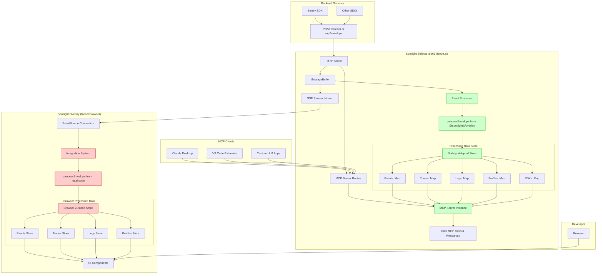
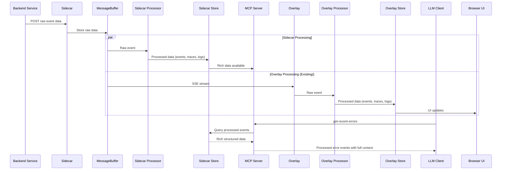

# MCP Integration: Dual Processing with Overlay Dependency

## Executive Summary

This plan implements MCP server functionality by having the sidecar import the `@spotlightjs/overlay` package as a dependency, enabling code reuse of integration processing logic. Both the overlay (browser) and sidecar (Node.js) will independently process the same raw events, eliminating the need for data bridges while providing rich MCP access to processed debugging data.

## Architecture Overview

### Dual Processing Pattern



### Data Flow Comparison



## Node.js Compatibility Strategy

### Browser Dependencies Analysis

| Component | Browser Dependency | Node.js Adaptation |
|-----------|-------------------|-------------------|
| `processEnvelope` | ✅ None (pure JS) | ✅ Direct import |
| Store slices | ✅ Zustand (universal) | ✅ Works in Node.js |
| `processStacktrace` | `window.fetch` | 🔧 Node.js fetch/axios |
| SDK injection | `window.__SENTRY__` | 🚫 Skip in Node.js |
| DOM events | `addEventListener` | 🚫 Skip in Node.js |
| Type definitions | ✅ None | ✅ Direct import |

### Environment Detection Pattern

```typescript
// packages/sidecar/src/mcp/nodeAdapter.ts
export const isNodeEnvironment = typeof window === 'undefined';

export function createNodeCompatibleFetch(): typeof fetch {
  if (isNodeEnvironment) {
    // Use Node.js fetch (available in Node 18+) or import axios
    return globalThis.fetch || require('axios').create();
  }
  return window.fetch;
}

export function skipBrowserOnlySetup<T>(browserFn: () => T, nodeFallback?: () => T): T | undefined {
  if (isNodeEnvironment) {
    return nodeFallback?.();
  }
  return browserFn();
}
```

## Implementation Plan

### Phase 1: Add Overlay Dependency (1 day)

#### 1.1 Update Sidecar Dependencies
```json
// packages/sidecar/package.json
{
  "dependencies": {
    "@sentry/node": "^8.49.0",
    "@spotlightjs/overlay": "workspace:*",  // ADD THIS
    "zustand": "^5.0.3",                    // ADD THIS
    "kleur": "^4.1.5",
    "launch-editor": "^2.9.1",
    "@jridgewell/trace-mapping": "^0.3.25"
  }
}
```

#### 1.2 Create Node.js Adapter Layer
```typescript
// packages/sidecar/src/mcp/nodeAdapter.ts
import type { StateCreator } from 'zustand';
import { create } from 'zustand';

// Re-export overlay types and utilities for Node.js use
export { 
  processEnvelope,
  type SentryEvent,
  type Trace,
  type SentryLogEventItem,
  type SentryProfileWithTraceMeta,
  type Sdk
} from '@spotlightjs/overlay/dist/integrations/sentry/index.js';

// Node.js compatible fetch implementation
export function createNodeFetch(): typeof fetch {
  if (typeof window === 'undefined') {
    // Node.js environment - use global fetch (Node 18+)
    return globalThis.fetch;
  }
  // Fallback for browser (shouldn't happen)
  return window.fetch;
}

// Create Node.js compatible store creator
export function createNodeStore<T>(storeCreator: StateCreator<T>): T {
  const store = create<T>()(storeCreator);
  return store.getState();
}
```

### Phase 2: Sidecar Integration Processing (2-3 days)

#### 2.1 Create Sidecar Store
```typescript
// packages/sidecar/src/mcp/sidecarStore.ts
import { create } from 'zustand';
import {
  createEventsSlice,
  createTracesSlice,
  createLogsSlice,
  createProfilesSlice,
  createSDKsSlice,
  createEnvelopesSlice,
  createSharedSlice,
  type SentryStore
} from '@spotlightjs/overlay/dist/integrations/sentry/store/index.js';
import { createNodeCompatibleSettingsSlice } from './nodeSettingsSlice.js';

// Create Node.js compatible Sentry store
export const useSidecarSentryStore = create<SentryStore>()((...args) => ({
  ...createEventsSlice(...args),
  ...createTracesSlice(...args),
  ...createLogsSlice(...args),
  ...createProfilesSlice(...args),
  ...createSDKsSlice(...args),
  ...createEnvelopesSlice(...args),
  ...createNodeCompatibleSettingsSlice(...args), // Node.js adapted
  ...createNodeCompatibleSharedSlice(...args),   // Node.js adapted
}));

export type SidecarSentryStore = typeof useSidecarSentryStore;
```

#### 2.2 Node.js Adapted Slices
```typescript
// packages/sidecar/src/mcp/nodeSettingsSlice.ts
import type { StateCreator } from 'zustand';
import type { SentryStore, SettingsSliceActions, SettingsSliceState } from '@spotlightjs/overlay';

export const createNodeCompatibleSettingsSlice: StateCreator<
  SentryStore,
  [],
  [],
  SettingsSliceState & SettingsSliceActions
> = (set) => ({
  // In Node.js, context lines are handled internally by the sidecar
  contextLinesProvider: 'internal://sidecar/context-lines',
  setSidecarUrl: (url: string) => {
    // No-op in Node.js - we ARE the sidecar
    console.log(`Node.js sidecar: setSidecarUrl called with ${url}, ignoring`);
  },
});

// packages/sidecar/src/mcp/nodeSharedSlice.ts  
import type { StateCreator } from 'zustand';
import { contextLinesHandler } from '../contextlines.js'; // Existing sidecar function
import type { SentryStore, SharedSliceActions, SentryErrorEvent } from '@spotlightjs/overlay';

export const createNodeCompatibleSharedSlice: StateCreator<
  SentryStore,
  [],
  [],
  SharedSliceActions
> = (set, get) => ({
  getEventById: (id: string) => get().eventsById.get(id),
  getTraceById: (id: string) => get().tracesById.get(id),
  getEventsByTrace: (traceId: string, spanId?: string | null) => {
    const { getEvents } = get();
    return getEvents().filter(evt => {
      const trace = evt.contexts?.trace;
      if (!trace || trace.trace_id !== traceId) return false;
      if (spanId !== undefined) return trace.span_id === spanId;
      return true;
    });
  },
  
  // Node.js compatible stacktrace processing
  processStacktrace: async (errorEvent: SentryErrorEvent): Promise<void> => {
    if (!errorEvent.exception?.values) return;

    await Promise.all(
      errorEvent.exception.values.map(async (exception) => {
        if (!exception.stacktrace?.frames) return;
        
        exception.stacktrace.frames.reverse();
        
        if (exception.stacktrace.frames.every(frame => 
          frame.post_context && frame.pre_context && frame.context_line)) {
          return; // Already have full context
        }

        try {
          // Use internal sidecar context lines handler instead of HTTP
          const stackTraceWithContext = await contextLinesHandler(exception.stacktrace);
          exception.stacktrace = stackTraceWithContext;
        } catch (error) {
          console.warn('Failed to process stacktrace in Node.js:', error);
        }
      })
    );
  },
  
  resetData: () => {
    set({
      envelopes: new Map(),
      eventsById: new Map(),
      tracesById: new Map(),
      sdks: new Map(),
      profilesByTraceId: new Map(),
      localTraceIds: new Set(),
      logsById: new Map(),
      logsByTraceId: new Map(),
    });
  },
});
```

#### 2.3 Sidecar Event Processor
```typescript
// packages/sidecar/src/mcp/eventProcessor.ts
import { processEnvelope } from '@spotlightjs/overlay';
import type { RawEventContext } from '@spotlightjs/overlay';
import { useSidecarSentryStore } from './sidecarStore.js';
import { logger } from '../logger.js';

export class SidecarEventProcessor {
  private store = useSidecarSentryStore;
  
  constructor() {
    logger.info('Sidecar event processor initialized');
  }
  
  async processRawEvent(rawEvent: RawEventContext): Promise<void> {
    try {
      // Use the same processEnvelope function as overlay
      const processed = processEnvelope(rawEvent);
      
      // The processEnvelope function automatically calls store methods
      // via useSentryStore.getState().pushEnvelope()
      // But in Node.js, we need to call our sidecar store
      
      // Extract envelope items and process them
      const [envelopeHeader, items] = processed.event;
      
      for (const [itemHeader, itemPayload] of items) {
        await this.processEnvelopeItem(itemHeader, itemPayload);
      }
      
      logger.debug(`Processed event in sidecar: ${itemHeader?.type || 'unknown'}`);
    } catch (error) {
      logger.error('Failed to process event in sidecar:', error);
    }
  }
  
  private async processEnvelopeItem(header: any, payload: any): Promise<void> {
    const store = this.store.getState();
    
    switch (header.type) {
      case 'event':
        if (payload.type === 'transaction') {
          await store.pushEvent(payload);
        } else if (payload.exception) {
          await store.pushEvent(payload);
        }
        break;
        
      case 'profile':
        await store.pushEvent(payload);
        break;
        
      case 'logs':
        await store.pushEvent(payload);
        break;
        
      default:
        logger.debug(`Unhandled envelope item type: ${header.type}`);
    }
  }
  
  // Expose store getters for MCP server
  getEvents() {
    return this.store.getState().getEvents();
  }
  
  getTraces() {
    return this.store.getState().getTraces();
  }
  
  getEventById(id: string) {
    return this.store.getState().getEventById(id);
  }
  
  getTraceById(id: string) {
    return this.store.getState().getTraceById(id);
  }
  
  getLogsByTraceId(traceId: string) {
    return this.store.getState().getLogsByTraceId(traceId);
  }
}
```

### Phase 3: Integration with MessageBuffer (1 day)

#### 3.1 Integrate with Existing Sidecar
```typescript
// packages/sidecar/src/main.ts (additions)
import { SidecarEventProcessor } from './mcp/eventProcessor.js';
import { createMcpServer } from './mcp/server.js';

// Add to startSidecar function
export function startSidecar(options: SideCarOptions = {}): Promise<SidecarInstance> {
  // ... existing code ...
  
  const buffer = new MessageBuffer<Payload>();
  
  // NEW: Create sidecar event processor
  const eventProcessor = new SidecarEventProcessor();
  
  // NEW: Create MCP server if enabled
  let mcpServer: McpServerInstance | null = null;
  if (options.mcp?.enabled) {
    mcpServer = createMcpServer(eventProcessor);
  }
  
  const incomingPayload: IncomingPayloadCallback = (body: string) => {
    const [contentType, payload] = parseIncomingData(body);
    buffer.push([contentType, payload]);
    
    // NEW: Process with sidecar processor for MCP
    if (mcpServer && contentType === 'application/x-sentry-envelope') {
      eventProcessor.processRawEvent({
        data: payload,
        contentType: contentType
      });
    }
  };
  
  // ... rest of existing code ...
  
  return {
    port,
    close: async () => {
      if (mcpServer) {
        await mcpServer.close();
      }
      server.close();
    }
  };
}
```

### Phase 4: MCP Server Implementation (2-3 days)

#### 4.1 Rich MCP Tools with Processed Data
```typescript
// packages/sidecar/src/mcp/server.ts
import { Server } from '@modelcontextprotocol/sdk/server/index.js';
import { StreamableHTTPTransport } from '@modelcontextprotocol/sdk/server/transport.js';
import { z } from 'zod';
import type { SidecarEventProcessor } from './eventProcessor.js';

export function createMcpServer(eventProcessor: SidecarEventProcessor) {
  const server = new Server('spotlight-mcp', '1.0.0');
  
  // Rich error analysis tool
  server.registerTool('get-recent-errors', {
    title: 'Get Recent Errors with Full Context',
    description: 'Get recent error events with stack traces, contexts, breadcrumbs, and related data',
    inputSchema: {
      count: z.number().optional().default(10).describe('Number of errors to fetch'),
      level: z.enum(['error', 'fatal']).optional().describe('Error severity level'),
      traceId: z.string().optional().describe('Filter by specific trace ID')
    }
  }, async ({ count, level, traceId }) => {
    const events = eventProcessor.getEvents()
      .filter(event => {
        if (!event.exception) return false;
        if (level && event.level !== level) return false;
        if (traceId && event.contexts?.trace?.trace_id !== traceId) return false;
        return true;
      })
      .slice(0, count);
    
    const enrichedErrors = events.map(event => ({
      id: event.event_id,
      message: event.exception?.values?.[0]?.value,
      type: event.exception?.values?.[0]?.type,
      stackTrace: event.exception?.values?.[0]?.stacktrace?.frames?.map(frame => ({
        filename: frame.filename,
        function: frame.function,
        lineno: frame.lineno,
        colno: frame.colno,
        context_line: frame.context_line,
        pre_context: frame.pre_context,
        post_context: frame.post_context
      })),
      contexts: event.contexts,
      breadcrumbs: event.breadcrumbs,
      tags: event.tags,
      user: event.user,
      timestamp: event.timestamp,
      environment: event.environment,
      release: event.release
    }));
    
    return {
      content: [{
        type: 'text',
        text: JSON.stringify(enrichedErrors, null, 2)
      }]
    };
  });
  
  // Complete trace analysis tool
  server.registerTool('get-trace-analysis', {
    title: 'Get Complete Trace Analysis',
    description: 'Get trace with span tree, performance metrics, and correlated data',
    inputSchema: {
      traceId: z.string().describe('Trace ID to analyze')
    }
  }, async ({ traceId }) => {
    const trace = eventProcessor.getTraceById(traceId);
    if (!trace) {
      throw new Error(`Trace ${traceId} not found`);
    }
    
    const relatedEvents = eventProcessor.getEvents()
      .filter(event => event.contexts?.trace?.trace_id === traceId);
    
    const logs = eventProcessor.getLogsByTraceId(traceId);
    
    return {
      content: [{
        type: 'text',
        text: JSON.stringify({
          trace: {
            trace_id: trace.trace_id,
            status: trace.status,
            root_transaction: trace.rootTransactionName,
            span_count: trace.spans.size,
            error_count: trace.errors,
            duration_ms: trace.timestamp - trace.start_timestamp,
            start_timestamp: trace.start_timestamp,
            end_timestamp: trace.timestamp
          },
          span_tree: trace.spanTree.map(span => ({
            span_id: span.span_id,
            parent_span_id: span.parent_span_id,
            op: span.op,
            description: span.description,
            status: span.status,
            start_timestamp: span.start_timestamp,
            timestamp: span.timestamp,
            duration_ms: span.timestamp - span.start_timestamp,
            tags: span.tags
          })),
          related_events: relatedEvents.length,
          correlated_logs: logs.length,
          performance_issues: trace.spanTree
            .filter(span => (span.timestamp - span.start_timestamp) > 1000)
            .map(span => ({
              span_id: span.span_id,
              description: span.description,
              duration_ms: span.timestamp - span.start_timestamp,
              issue: 'Slow span (>1s)'
            }))
        }, null, 2)
      }]
    };
  });
  
  // Correlated debugging tool
  server.registerTool('debug-error-with-context', {
    title: 'Debug Error with Full Context',
    description: 'Get error with related trace, logs, and complete debugging context',
    inputSchema: {
      errorId: z.string().describe('Error event ID')
    }
  }, async ({ errorId }) => {
    const error = eventProcessor.getEventById(errorId);
    if (!error || !error.exception) {
      throw new Error(`Error ${errorId} not found`);
    }
    
    const traceId = error.contexts?.trace?.trace_id;
    const trace = traceId ? eventProcessor.getTraceById(traceId) : null;
    const logs = traceId ? eventProcessor.getLogsByTraceId(traceId) : [];
    
    return {
      content: [{
        type: 'text',
        text: JSON.stringify({
          error: {
            id: error.event_id,
            message: error.exception.values?.[0]?.value,
            type: error.exception.values?.[0]?.type,
            stacktrace: error.exception.values?.[0]?.stacktrace,
            breadcrumbs: error.breadcrumbs,
            contexts: error.contexts,
            user: error.user,
            tags: error.tags
          },
          related_trace: trace ? {
            trace_id: trace.trace_id,
            status: trace.status,
            root_transaction: trace.rootTransactionName,
            span_count: trace.spans.size,
            duration_ms: trace.timestamp - trace.start_timestamp
          } : null,
          correlated_logs: logs.map(log => ({
            id: log.id,
            message: log.attributes?.message?.value,
            severity: log.severity_text,
            timestamp: log.timestamp,
            sdk: log.sdk
          })),
          debugging_suggestions: [
            trace && trace.errors > 1 ? 'Multiple errors in this trace - check for error cascade' : null,
            logs.length > 0 ? `${logs.length} log entries available for this trace` : null,
            error.breadcrumbs?.length ? `${error.breadcrumbs.length} breadcrumbs available showing user journey` : null
          ].filter(Boolean)
        }, null, 2)
      }]
    };
  });
  
  return server;
}
```

#### 4.2 Rich MCP Resources
```typescript
// Add to server.ts
server.registerResource('spotlight-errors',
  new ResourceTemplate('spotlight://errors/{errorId}', { 
    list: 'spotlight://errors' 
  }), {
    title: 'Error with Complete Context',
    description: 'Full error details with stack trace, breadcrumbs, and related data'
  }, async (uri, { errorId }) => {
    const error = eventProcessor.getEventById(errorId);
    const traceId = error?.contexts?.trace?.trace_id;
    const trace = traceId ? eventProcessor.getTraceById(traceId) : null;
    const logs = traceId ? eventProcessor.getLogsByTraceId(traceId) : [];
    
    return {
      contents: [{
        uri: uri.href,
        text: JSON.stringify({ 
          error, 
          related_trace: trace, 
          correlated_logs: logs 
        }, null, 2),
        mimeType: 'application/json'
      }]
    };
  }
);

server.registerResource('spotlight-traces',
  new ResourceTemplate('spotlight://traces/{traceId}', { 
    list: 'spotlight://traces' 
  }), {
    title: 'Complete Trace Analysis',
    description: 'Trace with span tree, performance data, and related events'
  }, async (uri, { traceId }) => {
    const trace = eventProcessor.getTraceById(traceId);
    const events = eventProcessor.getEvents()
      .filter(e => e.contexts?.trace?.trace_id === traceId);
    const logs = eventProcessor.getLogsByTraceId(traceId);
    
    return {
      contents: [{
        uri: uri.href,
        text: JSON.stringify({ 
          trace, 
          related_events: events, 
          correlated_logs: logs 
        }, null, 2),
        mimeType: 'application/json'
      }]
    };
  }
);
```

### Phase 5: Configuration and Integration (1 day)

#### 5.1 Configuration Options
```typescript
// packages/sidecar/src/types.ts
interface SideCarOptions {
  // ... existing options ...
  mcp?: {
    enabled: boolean;
    tools?: {
      [toolName: string]: {
        enabled: boolean;
        permissions?: string[];
      };
    };
    resources?: {
      [resourceName: string]: {
        enabled: boolean;
        cacheTtl?: number;
      };
    };
    processing?: {
      enableStacktraceProcessing?: boolean;
      enableProfileProcessing?: boolean;
      memoryLimits?: {
        maxEvents?: number;
        maxTraces?: number;
        ttlHours?: number;
      };
    };
  };
}
```

#### 5.2 MCP Route Integration  
```typescript
// packages/sidecar/src/main.ts (additions to route handlers)
const routes: Array<[RegExp, RequestHandler]> = [
  // ... existing routes ...
  
  // MCP server routes
  ...(mcpServer ? [
    [/^\/mcp$/, enableCORS(mcpRequestHandler(mcpServer))],
  ] : []),
];

function mcpRequestHandler(mcpServer: McpServerInstance): RequestHandler {
  return async (req, res) => {
    if (req.method === 'POST') {
      // Handle MCP requests
      await mcpServer.handleRequest(req, res);
    } else {
      res.writeHead(405, { 'Allow': 'POST' });
      res.end('Method Not Allowed');
    }
  };
}
```

## Benefits of This Architecture

### ✅ **Code Reuse and Consistency**
- **Same Processing Logic**: Both overlay and sidecar use identical integration processing
- **Consistent Data**: Both produce the same structured events, traces, logs, and profiles
- **Tested Logic**: Leverages existing, well-tested overlay integration code
- **Type Safety**: Shared TypeScript types ensure consistency

### ✅ **No Data Bridge Complexity**
- **No HTTP Requests**: Eliminates overlay → sidecar data synchronization
- **No Network Dependencies**: Each processes independently
- **No Latency**: Direct access to processed data in sidecar
- **No Failure Points**: No additional network failure modes

### ✅ **Rich MCP Capabilities**
- **Full Context**: Error events with complete stack traces and contexts
- **Trace Analysis**: Complete span trees with performance data
- **Correlated Data**: Logs linked to traces, profiles linked to transactions
- **Debugging Tools**: Context-aware debugging assistance

### ✅ **Independent Operation**
- **Overlay Independence**: Overlay continues to work without MCP
- **MCP Independence**: MCP works even if overlay is closed
- **Parallel Processing**: Both can process events simultaneously
- **Resource Isolation**: Each has its own memory and processing

### ✅ **Simple Deployment**
- **Single Dependency**: Just add `@spotlightjs/overlay` to sidecar
- **Backward Compatible**: No changes to existing functionality
- **Optional Feature**: MCP can be enabled/disabled via configuration
- **Node.js Native**: Runs efficiently in Node.js environment

## Potential Considerations

### ⚠️ **Memory Usage**
**Issue**: Duplicate processing means duplicate memory usage
**Mitigation**: 
- Implement TTL-based cleanup in sidecar store
- Configurable memory limits for events/traces
- Optional processing (can disable features not needed for MCP)

### ⚠️ **Processing Overhead**
**Issue**: Processing same events twice
**Mitigation**:
- Sidecar processing is opt-in via configuration
- Node.js processing is typically faster than browser
- Can skip expensive operations (like UI updates) in sidecar

### ⚠️ **Dependency Coupling**
**Issue**: Sidecar now depends on overlay package
**Mitigation**:
- Overlay is already well-structured and stable
- Can extract core processing logic to shared package if needed
- Version pinning ensures compatibility

## Testing Strategy

### Unit Tests
- Node.js environment detection and adaptation
- Store slice compatibility in Node.js
- Event processor with real Sentry data
- MCP tool and resource implementations

### Integration Tests  
- End-to-end: raw event → sidecar processing → MCP response
- Parallel processing: verify overlay and sidecar produce same results
- Memory limits and cleanup functionality
- Error handling and graceful degradation

### Compatibility Tests
- Verify overlay package works in Node.js
- Test with various Node.js versions (18+)
- Browser vs Node.js output comparison
- Performance benchmarking

## Migration and Rollout

### Phase A: Optional Feature
```bash
# Enable MCP with dual processing
spotlight-sidecar --mcp-enabled --mcp-tools="get-recent-errors,debug-error-with-context"
```

### Phase B: Gradual Adoption
- Enable for development environments first
- Monitor memory usage and performance
- Gather feedback from MCP client integrations

### Phase C: Production Ready
- Enable by default with resource limits
- Documentation and examples for LLM integrations
- Advanced tools and resources

## Conclusion

The dual-processing approach with overlay dependency provides the **optimal balance** of:

1. **Simplicity** - Reuse existing, tested integration logic
2. **Performance** - No network overhead or data bridges  
3. **Rich Features** - Full access to processed debugging data
4. **Maintainability** - Single source of truth for processing logic
5. **Flexibility** - Independent operation and optional adoption

This enables powerful MCP integrations that expose truly valuable debugging data to LLM applications while maintaining the robustness and performance of the existing Spotlight architecture.

The result is a clean, efficient implementation that makes Spotlight's debugging capabilities accessible to the growing ecosystem of AI-powered development tools, including Claude Desktop, VS Code extensions, and custom LLM applications.