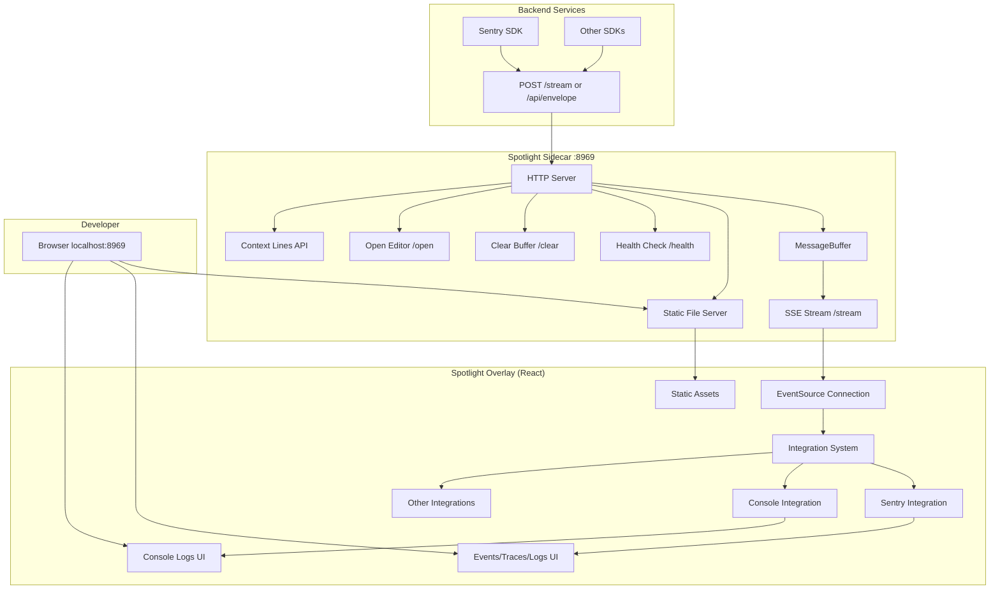
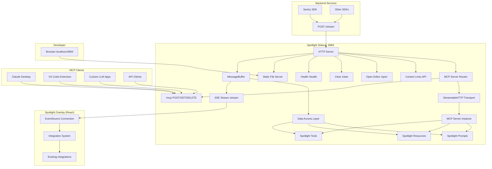

# Spotlight MCP Server Integration Plan

## Executive Summary

This document outlines the plan to integrate Model Context Protocol (MCP) server functionality into Spotlight, enabling LLM applications to access Spotlight's debugging data and capabilities through a standardized protocol.

## Current Architecture Analysis

### Spotlight Architecture Overview



### Data Flow Patterns

1. **Ingestion**: Backend services POST debug data → Sidecar HTTP server → MessageBuffer
2. **Distribution**: MessageBuffer → SSE stream → Overlay EventSource → Integration processing
3. **Display**: Processed data → React components → Developer UI

### Integration System

Each Spotlight integration:
- Registers for specific content types (e.g., `application/x-sentry-envelope`)
- Processes raw events into structured data
- Provides UI panels/tabs for visualization
- Manages local state with Zustand

## Proposed MCP Integration Architecture

### Design Decision: Embedded MCP Server

**Rationale**: Embed MCP server directly into the Spotlight sidecar for optimal integration:

- ✅ **Single Process**: Unified deployment and configuration
- ✅ **Direct Access**: MCP server can access MessageBuffer and integration data directly
- ✅ **Shared Infrastructure**: Reuse existing HTTP server, CORS, middleware
- ✅ **Performance**: No additional network hops or serialization overhead
- ✅ **Developer Experience**: Single port, unified configuration

### Enhanced Architecture with MCP



### MCP Server Capabilities Design

#### 1. Tools (Actions LLMs can execute)

| Tool Name | Description | Parameters | Returns |
|-----------|-------------|------------|---------|
| `get-recent-errors` | Fetch recent error events | `count?: number, level?: string` | List of error events with stack traces |
| `get-traces` | Fetch performance traces | `count?: number, operation?: string` | Transaction traces with spans |
| `get-logs` | Fetch application logs | `count?: number, level?: string` | Filtered log entries |
| `search-events` | Search through debug events | `query: string, type?: string` | Matching events |
| `clear-events` | Clear all buffered events | - | Success confirmation |
| `get-event-stats` | Get statistics about captured events | `timeRange?: string` | Event counts, error rates, etc. |

#### 2. Resources (Data LLMs can read)

| Resource URI | Description | Content Type |
|--------------|-------------|--------------|
| `spotlight://events/recent` | Recent events across all types | `application/json` |
| `spotlight://errors/{id}` | Specific error event details | `application/json` |
| `spotlight://traces/{id}` | Specific trace details | `application/json` |
| `spotlight://logs/stream` | Live log stream | `application/json` |
| `spotlight://stats/summary` | Overall debugging statistics | `application/json` |
| `spotlight://config` | Current Spotlight configuration | `application/json` |

#### 3. Prompts (Templates for LLM interactions)

| Prompt Name | Description | Parameters |
|-------------|-------------|------------|
| `debug-error` | Analyze an error for root cause | `errorId: string` |
| `optimize-performance` | Analyze performance traces | `traceId?: string` |
| `explain-trace` | Explain a trace in detail | `traceId: string` |
| `summarize-session` | Summarize debugging session | `timeRange?: string` |

## Implementation Plan

### Phase 1: Core MCP Server Integration (2-3 days)

#### 1.1 Dependencies and Setup
- Add MCP TypeScript SDK to sidecar package dependencies
- Update sidecar TypeScript configuration for MCP types
- Create MCP configuration structure

#### 1.2 Basic MCP Server Setup
- Create `src/mcp/` directory structure:
  ```
  src/mcp/
  ├── server.ts          # MCP server instance and configuration
  ├── transport.ts       # StreamableHTTP transport setup
  ├── tools/             # Tool implementations
  ├── resources/         # Resource implementations  
  ├── prompts/           # Prompt templates
  └── types.ts           # MCP-specific types
  ```

#### 1.3 HTTP Route Integration
- Extend existing sidecar HTTP server with MCP endpoints
- Add `/mcp` routes for POST, GET, DELETE methods
- Implement session management for MCP clients
- Add CORS configuration for MCP clients

**Files to modify:**
- `packages/sidecar/src/main.ts` - Add MCP routes to existing server
- `packages/sidecar/package.json` - Add MCP SDK dependency

### Phase 2: Data Access Layer (1-2 days)

#### 2.1 MessageBuffer Integration
- Create abstraction layer for accessing MessageBuffer data
- Implement filtered access to events by type, time, severity
- Add real-time event streaming capabilities for MCP resources

#### 2.2 Integration Data Access
- Interface with existing Sentry integration data structures
- Provide typed access to parsed events, traces, logs
- Implement efficient querying and pagination

**Files to create:**
- `packages/sidecar/src/mcp/dataAccess.ts` - Data access abstraction
- `packages/sidecar/src/mcp/eventFilters.ts` - Event filtering utilities

### Phase 3: Core Tools Implementation (2-3 days)

#### 3.1 Essential Tools
Implement highest-value tools first:

```typescript
// Example tool implementation
server.registerTool(
  'get-recent-errors',
  {
    title: 'Get Recent Errors',
    description: 'Fetch recent error events from Spotlight',
    inputSchema: {
      count: z.number().optional().describe('Number of errors to fetch (default: 10)'),
      level: z.enum(['error', 'fatal']).optional().describe('Error severity level')
    }
  },
  async ({ count = 10, level }) => {
    const errors = await dataAccess.getRecentErrors({ count, level });
    return {
      content: [{
        type: 'text',
        text: JSON.stringify(errors, null, 2)
      }]
    };
  }
);
```

#### 3.2 Tool Categories
- **Debugging Tools**: `get-recent-errors`, `search-events`, `get-event-stats`
- **Performance Tools**: `get-traces`, `analyze-performance`  
- **Log Tools**: `get-logs`, `filter-logs`
- **Management Tools**: `clear-events`, `get-config`

### Phase 4: Resources Implementation (1-2 days)

#### 4.1 Static Resources
- Current configuration, statistics, summaries
- Fixed-URI resources that provide snapshot data

#### 4.2 Dynamic Resources  
- Event streams, real-time logs
- Parameterized resources for specific events/traces

```typescript
// Example resource implementation
server.registerResource(
  'spotlight-errors',
  new ResourceTemplate('spotlight://errors/{errorId}', { list: 'spotlight://errors' }),
  {
    title: 'Error Details',
    description: 'Detailed information about a specific error'
  },
  async (uri, { errorId }) => {
    const error = await dataAccess.getErrorById(errorId);
    return {
      contents: [{
        uri: uri.href,
        text: JSON.stringify(error, null, 2),
        mimeType: 'application/json'
      }]
    };
  }
);
```

### Phase 5: Prompts and Advanced Features (1-2 days)

#### 5.1 Prompt Templates
- Debug analysis prompts
- Performance optimization suggestions
- Code review prompts based on errors

#### 5.2 Advanced Features
- Event streaming/subscriptions
- Real-time notifications to MCP clients
- Multi-session support

### Phase 6: Configuration and Documentation (1 day)

#### 6.1 Configuration Options
- Enable/disable MCP server
- Configure exposed tools and resources
- Security and access control settings

#### 6.2 Documentation
- MCP server capabilities documentation
- Client integration guides
- API reference documentation

## Technical Specifications

### MCP Server Configuration

```typescript
interface SpotlightMcpConfig {
  enabled: boolean;
  tools: {
    [toolName: string]: {
      enabled: boolean;
      permissions?: string[];
    };
  };
  resources: {
    [resourceName: string]: {
      enabled: boolean;
      cacheTtl?: number;
    };
  };
  transport: {
    enableAuth?: boolean;
    maxSessions?: number;
    sessionTimeout?: number;
  };
}
```

### Data Access Interfaces

```typescript
interface SpotlightDataAccess {
  // Event access
  getRecentEvents(options: EventQuery): Promise<Event[]>;
  getEventById(id: string): Promise<Event | null>;
  searchEvents(query: string, filters?: EventFilter): Promise<Event[]>;
  
  // Statistics
  getEventStats(timeRange?: TimeRange): Promise<EventStats>;
  
  // Real-time streaming
  subscribeToEvents(callback: (event: Event) => void): UnsubscribeFn;
  
  // Buffer management
  clearEvents(): Promise<void>;
}
```

### Error Handling Strategy

1. **Graceful Degradation**: MCP server failures should not affect core Spotlight functionality
2. **Request Isolation**: Individual MCP requests should not crash the sidecar
3. **Resource Limits**: Implement pagination and limits for large data requests
4. **Error Reporting**: Log MCP-specific errors separately from core Spotlight errors

### Security Considerations

1. **Local Access Only**: MCP server bound to localhost by default
2. **Data Sanitization**: Remove sensitive information from exported data
3. **Rate Limiting**: Prevent abuse of data access endpoints
4. **Session Management**: Proper cleanup of MCP client sessions

## Integration Testing Strategy

### Test Categories

1. **Unit Tests**: Individual tool, resource, and prompt implementations
2. **Integration Tests**: MCP server startup, data access layer, HTTP routes
3. **End-to-End Tests**: Full MCP client → server → data flow
4. **Performance Tests**: Large data set handling, concurrent client support

### Test Data Requirements

- Mock Sentry events, traces, and logs
- Various error scenarios and edge cases
- Performance data with realistic trace structures
- Multi-client session scenarios

## Deployment and Rollout

### Feature Flag Implementation

```typescript
interface SidecarOptions {
  // ... existing options
  mcp?: {
    enabled: boolean;
    config?: SpotlightMcpConfig;
  };
}
```

### Backward Compatibility

- MCP server is opt-in via configuration
- No changes to existing Spotlight functionality
- Existing HTTP endpoints remain unchanged
- Overlay integration remains unaffected

### Migration Path

1. **Development Phase**: MCP server disabled by default
2. **Beta Phase**: Opt-in MCP server for testing
3. **Stable Phase**: MCP server enabled by default with basic tools
4. **Enhanced Phase**: Advanced features and extended tool set

## Success Metrics

### Technical Metrics
- MCP server response time < 100ms for basic queries
- Support for 10+ concurrent MCP client sessions
- < 5% impact on existing Spotlight performance
- 99%+ uptime for MCP endpoints

### Developer Experience Metrics
- LLM applications can successfully query Spotlight data
- Error analysis workflow improved by MCP integration
- Reduced time-to-diagnosis for common debugging scenarios

## Future Enhancements

### Phase 2 Expansions
- **External MCP Server Support**: Connect to external MCP servers from Spotlight overlay
- **Custom Tool Framework**: Allow developers to register custom MCP tools
- **Advanced Analytics**: ML-powered insights based on debugging patterns
- **Multi-Project Support**: MCP access to data from multiple Spotlight instances

### Integration Opportunities
- **IDE Extensions**: Direct MCP integration with VS Code, JetBrains IDEs
- **CI/CD Integration**: MCP-powered debugging in automated testing pipelines
- **Monitoring Integration**: Bridge between Spotlight and production monitoring tools

## Conclusion

This integration plan provides a comprehensive approach to adding MCP server functionality to Spotlight while maintaining the existing architecture's integrity and performance. The embedded approach ensures optimal data access and developer experience while providing a standardized interface for LLM applications to interact with debugging data.

The phased implementation allows for incremental development and testing, ensuring stability at each stage. The resulting system will significantly enhance Spotlight's utility by making its debugging capabilities accessible to the growing ecosystem of LLM-powered development tools.