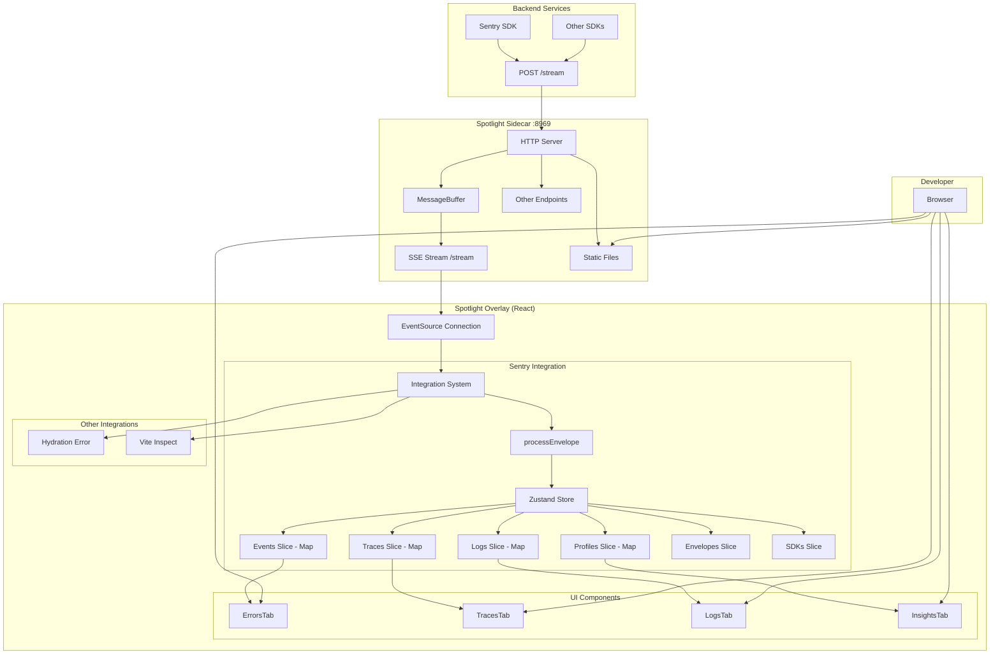
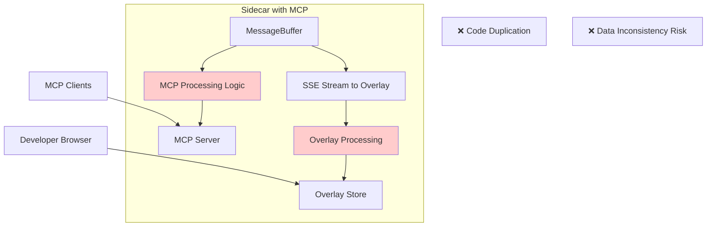
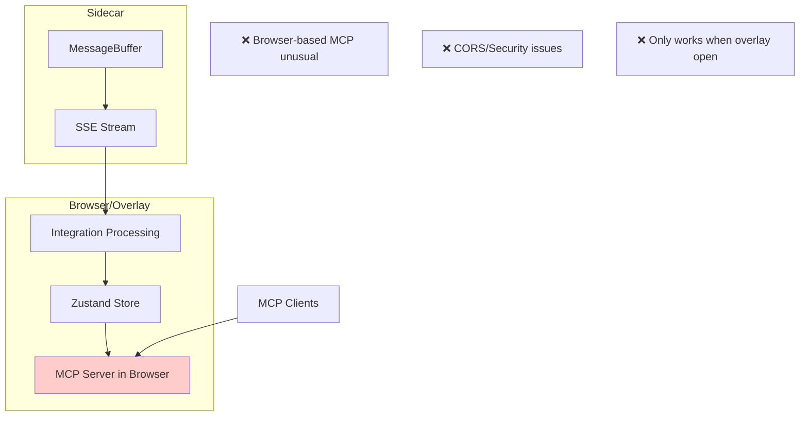
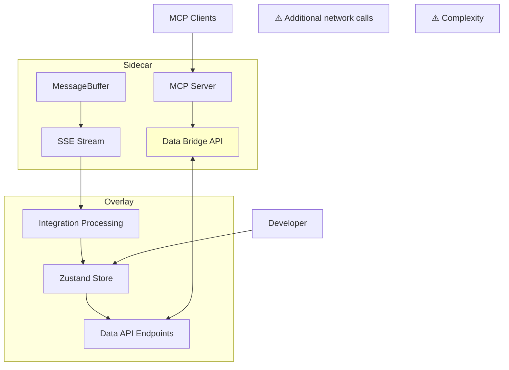
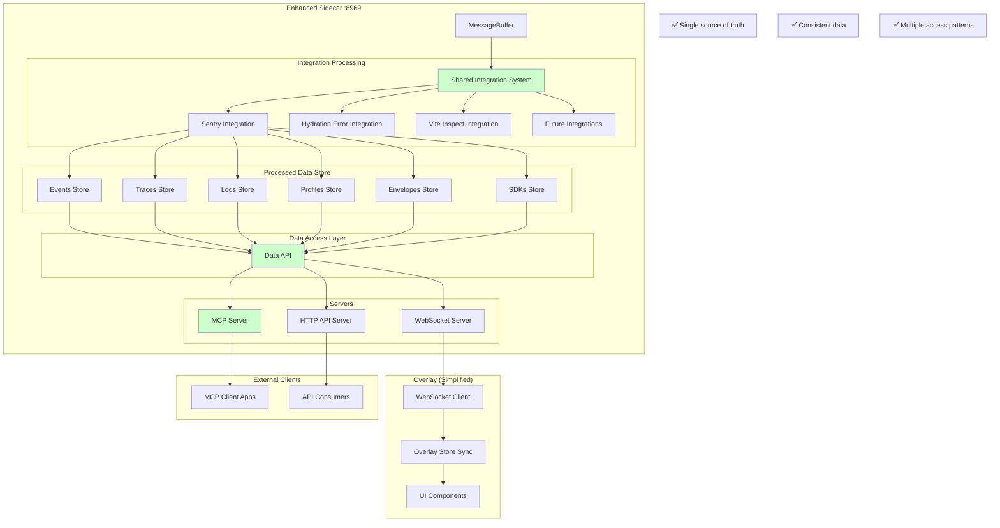
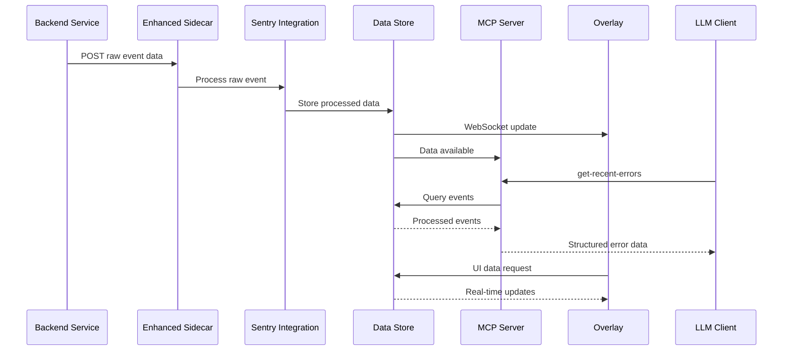

# MCP Server Integration with Spotlight Overlay Data

## Executive Summary

After investigating the overlay integrations, it's clear that the **processed integration data** is far more valuable than raw buffer data for MCP exposure. The Sentry integration alone provides rich APIs for accessing:

- 📊 **Processed Events** - Parsed errors with stack traces, typed events by ID
- 🔍 **Structured Traces** - Span trees, transaction relationships, performance data
- 📝 **Correlated Logs** - Logs by ID and by trace ID with proper typing
- ⚡ **Performance Profiles** - CPU profiles linked to traces
- 📦 **Raw Envelopes** - Original Sentry envelope data
- 🛠️ **SDK Metadata** - SDK versions, integrations, platform info

## Current Overlay Integration Architecture



## Architecture Options Analysis

### Option 1: MCP Server with Duplicated Processing ❌



**Problems:**
- Code duplication between MCP processing and overlay processing
- Risk of data inconsistency 
- Maintenance burden of keeping two processing paths in sync

### Option 2: Browser-Based MCP Server ❌



**Problems:**
- Browser-based MCP server is unusual and has limitations
- CORS and security challenges
- MCP server unavailable when overlay is closed

### Option 3: Data Bridge Pattern ⚠️



**Issues:**
- Additional network calls between sidecar and overlay
- Added complexity and potential latency
- Overlay must be running for MCP to work

### Option 4: Shared Integration Processing ✅ (Recommended)



## Recommended Architecture: Shared Integration Processing

### Key Design Principles

1. **Single Source of Truth**: Integration processing happens once in the sidecar
2. **Multiple Access Patterns**: Same data accessible via WebSocket (overlay), MCP (LLMs), and HTTP API
3. **Consistent Data**: All clients see the same processed data
4. **Performance**: No data duplication or unnecessary network calls

### Data Flow



### MCP Server Capabilities

With access to processed integration data, the MCP server can provide:

#### 🛠️ **Rich Tools**

| Tool | Description | Returns |
|------|-------------|---------|
| `get-recent-errors` | Get recent error events with full stack traces | Parsed SentryErrorEvent[] with typed exception data |
| `get-trace-by-id` | Get complete trace with span tree | Trace with organized span hierarchy and transaction relationships |
| `get-logs-by-trace` | Get all logs correlated to a trace | SentryLogEventItem[] with proper typing and metadata |
| `search-events` | Search through processed events | Filtered events with rich metadata |
| `get-performance-profile` | Get CPU profile for a trace | SentryProcessedProfile with flame graph data |
| `get-error-context` | Get full context for an error | Error + related trace + correlated logs + profiles |
| `analyze-trace-performance` | Analyze trace for performance issues | Performance insights with slow spans, bottlenecks |

#### 📊 **Rich Resources**

| Resource | Description | Content |
|----------|-------------|---------|
| `spotlight://events/recent` | Recent processed events | Typed SentryEvent[] with full metadata |
| `spotlight://traces/{traceId}` | Complete trace data | Trace with span tree, transactions, performance data |  
| `spotlight://errors/{eventId}` | Full error details | SentryErrorEvent with stack trace, context, breadcrumbs |
| `spotlight://logs/by-trace/{traceId}` | Trace-correlated logs | Logs with proper severity, SDK info, timestamps |
| `spotlight://profiles/{traceId}` | Performance profile | CPU profile with flame graph data, thread info |
| `spotlight://sdks/active` | Active SDK information | SDK versions, integrations, platform details |

#### 🎯 **Intelligent Prompts**

| Prompt | Description | Context |
|--------|-------------|---------|
| `debug-error-with-context` | Debug error with full context | Error + trace + logs + profile data |
| `analyze-performance-bottleneck` | Find performance bottlenecks | Trace analysis with span timing data |
| `explain-error-root-cause` | Root cause analysis | Error context + related events + user journey |
| `optimize-slow-transaction` | Optimize slow transaction | Performance profile + span analysis + suggestions |

## Implementation Plan

### Phase 1: Move Integration Processing to Sidecar (3-4 days)

#### 1.1 Create Shared Integration System
```typescript
// packages/sidecar/src/integrations/
├── integration.ts          # Base integration interface (shared with overlay)
├── sentry/
│   ├── index.ts            # Moved from overlay
│   ├── types.ts            # Moved from overlay  
│   ├── store/              # Moved from overlay
│   └── utils/              # Moved from overlay
├── hydration-error/        # Moved from overlay
└── vite-inspect/           # Moved from overlay
```

#### 1.2 Create Data Store in Sidecar
```typescript
// packages/sidecar/src/store/
├── index.ts                # Main store (similar to overlay's Zustand store)
├── events.ts               # Events storage and retrieval
├── traces.ts               # Traces storage and retrieval  
├── logs.ts                 # Logs storage and retrieval
└── types.ts                # Store types
```

#### 1.3 Add Data Access APIs  
```typescript
// packages/sidecar/src/api/
├── websocket.ts            # WebSocket server for overlay
├── http.ts                 # HTTP API for external consumers
└── dataAccess.ts           # Shared data access layer
```

### Phase 2: Add MCP Server (1-2 days)

#### 2.1 MCP Server Implementation
```typescript
// packages/sidecar/src/mcp/
├── server.ts               # MCP server setup
├── tools.ts                # MCP tools implementation
├── resources.ts            # MCP resources implementation
├── prompts.ts              # MCP prompts implementation
└── dataAccess.ts           # MCP-specific data access
```

#### 2.2 Tool Implementations
```typescript
server.registerTool('get-recent-errors', {
  title: 'Get Recent Errors',
  description: 'Get recent error events with full context',
  inputSchema: {
    count: z.number().optional().default(10),
    level: z.enum(['error', 'fatal']).optional(),
    traceId: z.string().optional()
  }
}, async ({ count, level, traceId }) => {
  const errors = await dataStore.getEvents({
    type: 'error',
    count,
    level,
    traceId
  });
  
  return {
    content: [{
      type: 'text',
      text: JSON.stringify(errors.map(error => ({
        id: error.event_id,
        message: error.exception?.values?.[0]?.value,
        type: error.exception?.values?.[0]?.type,
        stackTrace: error.exception?.values?.[0]?.stacktrace,
        context: error.contexts,
        breadcrumbs: error.breadcrumbs,
        timestamp: error.timestamp,
        tags: error.tags,
        user: error.user
      })), null, 2)
    }]
  };
});
```

### Phase 3: Update Overlay to Use Sidecar Data (2-3 days)

#### 3.1 Replace Local Processing with WebSocket Client
```typescript
// packages/overlay/src/integrations/sentry/index.ts
export default function sentryIntegration() {
  return {
    name: "sentry",
    forwardedContentType: [], // No longer processes raw events
    
    setup: ({ sidecarUrl }) => {
      // Connect to sidecar WebSocket instead of processing locally
      const ws = new WebSocket(`${sidecarUrl.replace('http', 'ws')}/ws`);
      
      ws.onmessage = (event) => {
        const data = JSON.parse(event.data);
        // Update local store with processed data from sidecar
        useSentryStore.getState().syncFromSidecar(data);
      };
    },
    
    panels: () => {
      // Same UI panels, but data comes from sidecar sync
      // ... existing panel code
    }
  };
}
```

#### 3.2 Simplify Overlay Store
```typescript
// packages/overlay/src/integrations/sentry/store/store.ts
const useSentryStore = create<SentryStore>()((...a) => ({
  // Remove all processing logic - just store synced data
  ...createSyncSlice(...a),  // Handles WebSocket sync
  ...createUISlice(...a),    // UI-specific state only
}));
```

### Phase 4: Testing and Migration (1-2 days)

#### 4.1 Integration Tests
- Test MCP server with real Sentry data
- Verify overlay receives same data as before
- Test concurrent access from multiple MCP clients

#### 4.2 Performance Testing
- Measure impact of moving processing to sidecar
- Verify WebSocket performance for overlay updates
- Test MCP response times

## Data Flow Diagrams

### Current vs. Proposed Data Flow

```mermaid
graph TB
    subgraph "CURRENT: Processing in Overlay"
        A1[Raw Event] --> B1[Sidecar Buffer]
        B1 --> C1[SSE to Overlay]
        C1 --> D1[Integration Processing]
        D1 --> E1[Overlay Store]
        E1 --> F1[UI Components]
        
        style D1 fill:#ffcccc
        style E1 fill:#ffcccc
    end
    
    subgraph "PROPOSED: Processing in Sidecar"
        A2[Raw Event] --> B2[Sidecar Buffer]
        B2 --> C2[Integration Processing]
        C2 --> D2[Sidecar Store]
        D2 --> E2[WebSocket to Overlay]
        D2 --> F2[MCP Server]
        E2 --> G2[Overlay Store Sync]
        G2 --> H2[UI Components]
        F2 --> I2[LLM Clients]
        
        style C2 fill:#ccffcc
        style D2 fill:#ccffcc
        style F2 fill:#ccffcc
    end
```



## Benefits of This Architecture

### ✅ **For MCP Integration**
- **Rich Data Access**: Full access to processed events, traces, logs, profiles
- **Real-time Updates**: MCP clients can receive live updates as new data arrives  
- **Consistent Data**: Same data processing as overlay, no discrepancies
- **Performance**: Direct access to processed data, no additional processing overhead

### ✅ **For Overlay**
- **Simplified Architecture**: Overlay becomes pure UI layer
- **Better Performance**: No client-side processing overhead
- **Consistent Experience**: Same data and functionality as before
- **Real-time Sync**: WebSocket provides instant updates

### ✅ **For Development** 
- **Single Source of Truth**: All integration logic in one place
- **Better Testability**: Integration processing can be unit tested independently
- **Extensibility**: Easy to add new integrations and access patterns
- **API Flexibility**: Can expose data via multiple protocols (WebSocket, HTTP, MCP)

## Migration Strategy

### Phase A: Parallel Implementation
1. Implement processing in sidecar alongside existing overlay processing
2. Add feature flag to switch between old and new data sources
3. Verify data consistency between both approaches

### Phase B: Gradual Migration  
1. Enable sidecar processing by default
2. Keep overlay processing as fallback
3. Monitor for any issues or regressions

### Phase C: Cleanup
1. Remove old overlay processing code
2. Simplify overlay to pure UI layer
3. Clean up unused dependencies

## Conclusion

This architecture provides the **best of both worlds**:

- **MCP clients get rich, processed data** - structured events, trace trees, correlated logs, performance profiles
- **Overlay maintains current functionality** - same UI, same features, same performance  
- **Single source of truth** - all integration processing happens once in the sidecar
- **Multiple access patterns** - WebSocket for overlay, MCP for LLMs, HTTP API for other tools

The result is a more powerful MCP integration that exposes truly valuable debugging data to LLM applications, while also improving the overall Spotlight architecture.